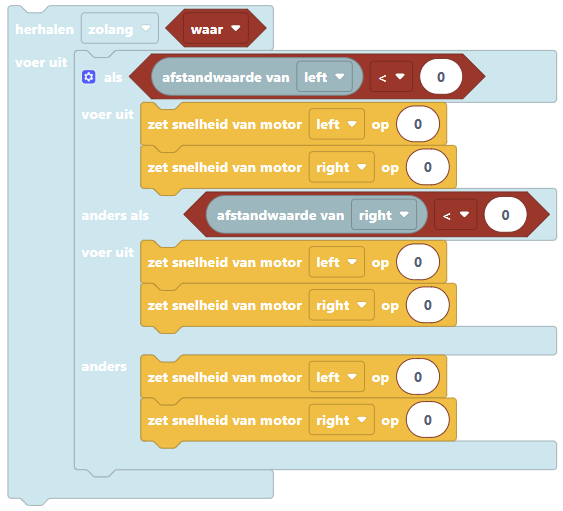
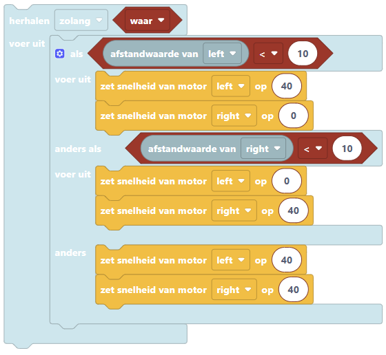

:orphan:

.. _obstacles_ultrasonic:

Obstakels ontwijken met ultrasoonsensoren
######################

.. article-info::
    :author: :fa:`brain` Programmeren
    :read-time: 45 min

1
---

In deze workshop leer je hoe je de robot obstakels kunt laten ontwijken. Dit doe je met twee ultrasoonsensoren.

Controleer eerst of er twee ulstrasoonsensoren op de robot zijn aangesloten. Is dat nog niet zo? Sluit dan eerst de ultrasoonsensoren aan. De foto's hieronder laten zien hoe een ultrasoonsensor eruit niet, waar deze op de robot moet zitten en hoe je het kunt aansluiten.

2
---

.. grid:: 1 2 2 2
   :gutter: 2

   .. grid-item::

      Om een robot zelf een obstakel te laten ontwijken, heb je een programma nodig. Zo'n programma heet ook wel een algoritme: een stap-voor-stap plan dat de robot vertelt wat het moet doen. Er zijn verschillende manieren om zo'n programma te maken.

      De robot heeft twee ultrasoonsenosren aan de voorkant. Deze detecteren of er obstakels in de buurt zijn, waar de robot omheen moet rijden. 

      **Vraag**

      Bekijk de afbeelding hiernaast. 

      - Wat moet de robot doen als de linker sensor een obstakel herkent (situatie 1)? 
      - Wat moet de robot doen als de rechter sensor een obstakel herkent (situatie 2)?

      .. dropdown:: :octicon:`comment` Klik hier voor het antwoord

         De robot heeft twee ultrasoonssensoren aan de voorkant. Een sensor kijkt meer links en de ander kijkt meer naar rechts. Met geluid kunnen de sensoren obstakels herkennen die dichtbij zijn. 

         - Ziet de linker sensor een obstakel, dan kan de robot naar rechts rijden om op het obstakel heen te gaan.

         - Ziet de rechter sensor een obstakel, dan kan de robot naar links rijden om op het obstakel heen te gaan.

         - Als beide sensoren geen obstakel zien, dan kan de robot rechtdoor blijven rijden. 

         Zo kijkt de robot steeds om zich heen en past het de route aan. Zo botst het niet en kan het veilig rondrijden. 

   .. grid-item::

      .. image:: _media/ultrasonic-situation.png
         :width: 500
         :alt: Ultrasoonsensoren situatie obstakels herkennen

.. dropdown:: :octicon:`dependabot` Hoe werkt een ultrasoonsensor?

    Een ultrasoonsensor helpt de robot om te zien of er iets in de weg staat. Deze sensor zit vooraan op de robot en gebruikt geluidsgolven.

    - De sensor stuurt onhoorbare geluidsgolven vooruit (zoals een soort piepje).

    - Als er een obstakel is, zoals een muur of een doos, kaatst het geluid terug naar de sensor.

    - Als er niets in de weg staat, komt er geen geluid terug.

    Zo weet de robot of er iets dichtbij is. Als er een obstakel wordt gezien, kan de robot bijvoorbeeld stoppen, omdraaien, of uitwijken.

3
---
Probeer nu een programma te schrijven waarmee de robot obstakels kan ontwijken. Ga via een nieuw tabblad op internet naar: **mirte.local** en gebruik de blokken om een programma te schrijven.

Kom je er even niet uit? Gebruik dan de tips in het 'Help'-menu hieronder. Op de volgende pagina staat een voorbeeldprogramma, maar probeer het eerst zelf! Er zijn namelijk meerdere manieren om dit op te lossen.

.. dropdown:: :fa:`question-circle` Help

    - Ik weet niet wat ik moet doen
        - Je wilt dat de robot obstakels herkent en er niet tegen aan rijdt. 
        - Een ultrasoonsensor meet de afstand tot een voorwerp. 
            - Als iets dichtbij is, moet de robot sturen en eromheen rijden.
            - Als er niets in de weg staat, kan de robot gewoon rechtdoor rijden.
        - Denk na: Welke onderdelen van de robot gebruik je om hem te laten rijden en draaien? Gebruik die blokken in jouw programma.
        - Gebruik wat je hebt geleerd tijdens de workshop ‘Wat als...’

    - Welke afstandwaarde moet ik invullen?
        - De afstandwaarde is het aantal centimeter dat er tussen de robot en een obstakel zit. 
            - Wil je dat de robot optijd reageert op een obstakel, dan kun je deze waarde groter maken.
            - Wil je dat de robot vlak voor een obstakel pas omdraait, dan kun je deze waarde kleiner maken. 

    - De robot blijft maar tegen de obstakels aanrijden?
        - Het kan zijn dat de obstakels het geluid niet (genoeg) terugkaatsen, zoals gordijnen, kleding en papier. Probeer wat andere obstakels te gebruiken en kijk hoe de robot daarop reageert.
        - Het kan ook zijn dat de obstakels te klein zijn, waardoor de geluidsgolven langs de obstakel gaan, zoals bij een dunne stoelpoot of een obstakel die heel laag is. Probeer wat grotere obstakels te gebruiken en kijk hoe de robot daarop reageert.

4
---
Hieronder staat een voorbeeldprogramma afgebeeld. Deze klopt alleen nog niet helemaal. Kun jij het programma afmaken?

Op de volgende pagina staat het antwoord.

5
---

Hieronder is het antwoord van het voorbeeldprogramma afgebeeld. 

- De afstandwaarde van de ultrsoonsenor is het aantal centimeter dat er tussen de robot en een obstakel zit. Door deze bijvoorbeeld op 10 te zetten, zal de robot reageren op een obstakel dat 10 centimeter of dichterbij ligt. 

- Door één motor aan te zetten en één motor uit, kan de robot een bocht maken. Zo kan de robot snel draaien.

- Let goed op dat alle groter dan (>) en kleiner dan (<) tekens de goede kant op staan.

**Opdracht**

- Wat zou er gebeuren als je de snelheden van de motoren aanpast? Of de afstandwaardes van de ultrasoonsensoren? Probeer het zelf uit en kijk hoe de robot reageert.
