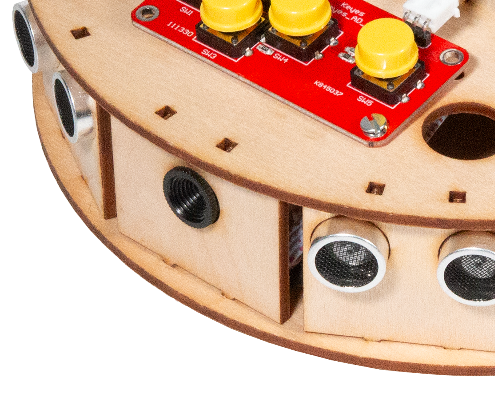

:orphan:

Camera
################################

.. article-info::
    :author: :fa:`eye` Sensoren
    :read-time: 10 min

1
---

Om mee te kijken met wat MIRTE ziet, kun je een camera aansluiten. Deze workshop legt uit hoe je dat kunt doen. 

2
---

Op deze manier sluit je de camera aan op de robot.

3
---

Ga via een nieuw tabblad op internet naar: **mirte.local/ros-video**.
<b>Klik vervolgens op '**Stream**'. Hier kun je meekijken met wat de camera van MIRTE allemaal ziet.

Gebruik de toetsen I, J, L en < om MIRTE vooruit (I), achteruit (<), naar links (J) of naar rechts (L) te bewegen. Probeer nu niet naar de robot te kijken, maar kijk mee via de camera. Beleef hoe de wereld eruit ziet vanuit MIRTE!

Tip: Maak een parcours waar MIRTE doorheen moet rijden. Kijk of het je lukt om met behulp van de camera binnen het parcours te blijven. 
