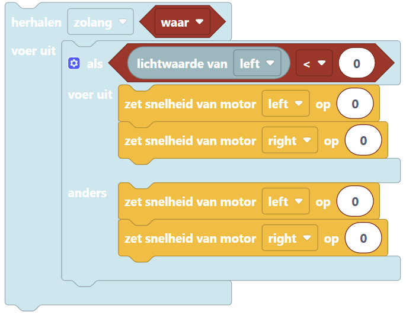

:orphan:

.. _1-line-sensor:

Lijnvolgen met 1 sensor
######################

.. article-info::
    :author: :fa:`brain` Programmeren
    :read-time: 45 min

1
---

In deze workshop leer je hoe je de robot een lijn kunt laten volgen. Dit doe je met één lijnvolgsensor.

Controleer eerst of er een lijnvolgsensor op de robot is aangesloten. Is dat nog niet zo? Sluit dan eerst de lijnvolgsensor aan. De foto's hieronder laten zien hoe een lijnvolgsensor eruit niet, waar deze op de robot moet zitten en hoe je het kunt aansluiten.

2
---

.. grid:: 1 2 2 2
   :gutter: 2

   .. grid-item::

      Om een robot zelf een lijn te laten volgen, heb je een programma nodig. Zo'n programma heet ook wel een algoritme: een stap-voor-stap plan dat de robot vertelt wat het moet doen. Er zijn verschillende manieren om dit te maken, maar in deze workshop leer je de Bang-Bang methode. Dat is een eenvoudige manier waarbij de robot snel wisselt tussen links en rechts sturen.

      De robot heeft één lijvolgsensor aan de onderkant. Die kan meten of de robot op een zwarte lijn rijdt of niet. In de workshop 'Licht meten' heb je geleerd welke getallen de sensor gebruikt om zwart of wit te herkennen.

      **Vraag**

      Bekijk de afbeelding hiernaast. 

      - Wat moet de robot doen als de sensor de zwarte lijn ziet (situatie 1)? 
      - Wat moet de robot doen als de sensor wit ziet (situatie 2)?

      .. dropdown:: :octicon:`comment` Klik hier voor het antwoord

         Omdat er maar één sensor is, kan de robot niet precies in het midden van de lijn blijven. In plaats daarvan laat je de robot steeds heen en weer bewegen:

         - Ziet het zwart, dan stuurt het naar wit.

         - Ziet het wit, dan stuurt het terug naar zwart.

         Zo blijft de robot als het ware stuiteren tegen de lijn aan, en raakt het de lijn niet kwijt.

   .. grid-item::

      .. image:: _media/situatie-1-sensor.png
         :width: 500
         :alt: Bang Bang method explained in drawing with one sensor

.. dropdown:: :octicon:`dependabot` Hoe werkt een lijnvolgsensor?

   Een lijnvolgsensor gebruikt infrarood licht om te zien waar de robot rijdt. Deze sensor zit onderaan de robot en schijnt licht op de grond.

   - Lichte kleuren, zoals wit, sturen het licht terug.

   - Donkere kleuren, zoals zwart, houden het licht vast.

   Zo weet de robot of hij op een zwarte lijn rijdt of niet.

3
---
Probeer nu een programma te schrijven waarmee de robot een lijn kan volgen. Ga via een nieuw tabblad op internet naar: **mirte.local** en gebruik de blokken om een programma te schrijven.

Kom je er even niet uit? Gebruik dan de tips in het 'Help'-menu hieronder. Op de volgende pagina staat een voorbeeldprogramma, maar probeer het eerst zelf! Er zijn namelijk meerdere manieren om dit op te lossen.

.. dropdown:: :fa:`question-circle` Help

   - Ik weet niet wat ik moet doen
      - Je wilt dat de robot een zwarte lijn volgt. Dit kun je doen door de robot naar wit te laten rijden wanneer de sensor zwart ziet en de robot naar zwart te laten rijden, wanneer de robot wit ziet. 
      - Denk na: welke onderdelen van de robot gebruik je om het te laten rijden en draaien? Gebruik die blokken in jouw programma. 
      - Gebruik wat je hebt geleerd tijdens de workshop 'Wat als...' en 'Licht meten'

   - Welke lichtwaarde moet ik invullen?
      - In de workshop 'Licht meten' heb je geleerd hoe je de sensor kunt gebruiken om te zien of de robot op wit of zwart rijdt.
         - Zwarte ondergrond = lage lichtwaarde
         - Witte ondergrond = hoge lichtwaarde
      - Kies een getal dat precies tussen de waarde van zwart en wit ligt. De waarde die de lijnvolgsensor meet, blijft altijd een beetje veranderen. Door precies het midden van de twee waarden te gebruiken, is het altijd duidelijk voor de robot wat het moet doen.
   
   - De robot werkte net nog goed, maar nu niet meer en ik heb niks aangepast?
      - De lijnvolgsensor meet infrarood (IR) licht. Wanneer je de robot in een andere ruimte gebruikt, er zonlicht door de ramen schijnt of je een lamp aan hebt gezet, kan de robot andere waardes meten.
      - Gebruik de robot in een ruimte waar het licht niet te veel veranderd en meet zo nodig de waardes voor het rijden op zwart en wit opnieuw. 

4
---
Hieronder staat een voorbeeldprogramma afgebeeld. Deze klopt alleen nog niet helemaal. Kun jij het programma afmaken?

Op de volgende pagina staat het antwoord.

5
---

Hieronder is het antwoord van het voorbeeldprogramma afgebeeld. 

- In de workshop 'Licht meten' heb je geleerd hoe je de lichtwaarde kunt meten en gebruiken. Deze lichtwaarde is anders voor elke ruimte waarin je de robot gebruikt. Het kan dus zo zijn dat de waardes die nu in het antwoord staan niet werken voor jouw robot. Let ook op dat deze waarde voor beide sensoren kan verschillen. Meet deze waardes dus altijd zelf en vul jouw getallen in.

- Door één motor aan te zetten en één motor uit, kan de robot een bocht maken. Zo kan de robot snel terug sturen naar de lijn. 

- Let goed op dat alle groter dan (>) en kleiner dan (<) tekens de goede kant op staan.

.. image:: _media/blockly-lijnvolgen-1sensor-nl-antwoord.png
   :width: 500
   :alt: Antwoord van voorbeeldcode lijnvolgen met 2 sensoren

**Opdracht**

- Wat zou er gebeuren als je de snelheden van de motoren aanpast? Probeer het zelf uit en kijk hoe de robot reageert.
