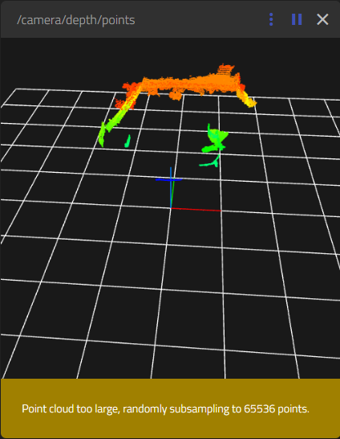

:orphan:
:hide-toc:
:html_theme.sidebar_secondary.remove:

.. WARNING_SPOT

1.1 Viewing PointCloud2 data
#################################

While you robot is updating. You can already start having a look at the
raw pointcloud data. Since pointcloud data is consuming a lot of 
bandwidth it is highly recommended to connect
you robot via an ethernet cable rather than wifi.

You can open ROSBoard which runs on the robot (by
`opening a browser to mirte.local:8888 <http://mirte.local:8888>`_), and
add the /camera/depth/points topic. This will show you an image of the 
current 

As you see there is already a lot of data to be shown, and ROSboard
is already downsampling. But this downsampling is done on your browser, 
and not on the robot itself.

.. admonition:: info

   Please note that this viewing of the PointCloud already asks
   a lot of the CPU. You can check this with htop. Just closing the
   pointcloud viewer in ROSboard is not enough to get it back to 
   normal. You really have to refresh the ROSboard page.

   .. code-block:: console

      $ htop

.. admonition:: info

   This might cause ROSboard to crash (you will not be able to
   reload thev webpage). If this is the case, you can restart 
   the web interface:

   .. code-block:: console

      $ sudo systemctl restart mirte-web-interface