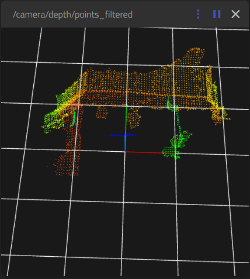

:orphan:
:hide-toc:
:html_theme.sidebar_secondary.remove:

.. WARNING_SPOT

1.5 Publishing filtered pointcloud
##################################

Now that we know the data is nicely scaled down, we of course
also want to cidualize this. That can be done by publishing this
data again to another topic.

For this we need to add a publisher:

.. code-block:: cpp
  :linenos:
  :emphasize-lines: 1

   rclcpp::Publisher<sensor_msgs::msg::PointCloud2>::SharedPtr publisher_;
   rclcpp::Subscription<sensor_msgs::msg::PointCloud2>::SharedPtr subscription_;

Initilize this publisher in the constructor:

.. code-block:: cpp
  :linenos:
  :emphasize-lines: 4-7

    auto qos = rclcpp::QoS(rclcpp::KeepLast(10));
    qos.best_effort();

    publisher_ =
       this->create_publisher<sensor_msgs::msg::PointCloud2>(
       "/camera/depth/points_filtered",
       qos);

    subscription_ =
       this->create_subscription<sensor_msgs::msg::PointCloud2>(
       "/camera/depth/points",
       qos,
       std::bind(
          &PCLDetector::cloudCallback,
          this,
          std::placeholders::_1));

And actually publish the data as soon as it gets availablein the
callback function:

.. code-block:: cpp
  :linenos:
  :emphasize-lines: 11-14

   // 3 cm voxels
   voxel_filter.setLeafSize(0.03f, 0.03f, 0.03f);

   voxel_filter.filter(*downsampled_cloud);
   RCLCPP_INFO(
     get_logger(),
     "Original: %zu points, Downsampled: %zu points",
     cloud->size(),
     downsampled_cloud->size());

   auto output_msg = sensor_msgs::msg::PointCloud2();
   pcl::toROSMsg(*downsampled_cloud, output_msg);
   output_msg.header = msg->header;
   publisher_->publish(output_msg);

We can again build and run the node:

.. code-block:: console

   $ colcon build --packages-select pcl_workshop
   $ ros2 run pcl_workshop my_pcl_filter

After this has been done, you can now see this filtered
data in the `ROSboard <http://mirte.local:8888>`_), and
add the /camera/depth/points_filtered topic. This will 
show you an image of the filtered pointcloud.

